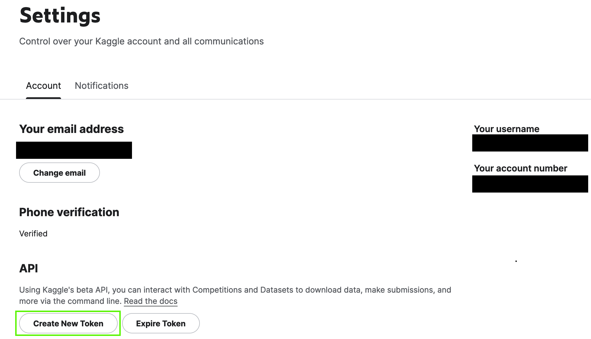

# The Vesuvius Ink detection Challenge 

The Ink Detection Challenge is a subproblem of the bigger [Vesuvius challenge.](https://scrollprize.org/), where a prize of $700k is offered to the first team able to read an unopened Herculaneum scroll that was carbonised duing the eruption of Mount Vesuvius through 3D X-ray scans. 

The Ink Detection Challenge focuses on the detection of ink, based on 3D X-ray scans. Trainign data for Ink detection training is provided from 3 broken-off fragments of scrolls that where opened physically. As ground truth data, labels where annotated manually for each pixel. Because the evaluation of ink detection models more measurable, a [Kaggle competition](https://www.kaggle.com/competitions/vesuvius-challenge-ink-detection/overview), was laucnhed for this.

More information is available on the notion page:
https://www.notion.so/dataroots/Ink-detection-Challenge-1c3a4b5030244ef99c52dd68a25b43b2


## Structure

TODO

## Notebooks

A variety of notebooks is provided in the [notebooks folder](notebooks). All of these are adapted from Kaggle notebooks (links to the Kaggle notebooks are provided as well). The easiest way to run these is to run them on Kaggle. If you want to run them either locally or any other remote resource you will first have to set up a compatible environment and download the used datasets.
(Kaggle docker images are available [here](https://github.com/Kaggle/docker-python) but are very bulky (~45GB) uncompressed and are not compatible with Apple silicon so creating your own python venv might be more advisable, especially for a local setup)

### Downloading datasets
1. Install the kaggle API
```
pip install kaggle
```
2. Go to your [kaggle account page](https://www.kaggle.com/settings/account) and click the "Create New Token" button  

3. Move the downloaded "kaggle.json" to ~/.kaggle/kaggle.json
4. Download the dataset
```
kaggle competitions download -c vesuvius-challenge-ink-detection # for competition datasets
kaggle datasets download -d thenoodleninja/vesuvius-flattened # for other datasets
```

### EDA notebook ([kaggle notebook](https://www.kaggle.com/code/thenoodleninja/exploratory-data-analysis))

This notebook performs basic EDA on the [vesuvius-challenge-ink-detection](https://www.kaggle.com/competitions/vesuvius-challenge-ink-detection) dataset. This includes basic visualizations, and some statistical analysis.

### Fragment flattening ([kaggle notebook](https://www.kaggle.com/code/thenoodleninja/fragment-flattening))

This notebooks attempts to flatten the papyrus fragments from the [vesuvius-challenge-ink-detection](https://www.kaggle.com/competitions/vesuvius-challenge-ink-detection) dataset. A comparison between different classical CV techniques is performed and code to flatten the fragments, based on a height map generated with Sobel edge detection, is provided as well.

### Resnet18d training ([kaggle notebook](TODO))

The notebook use to train 


### Resnet18d inference ([kaggle notebook](TODO))

This notebook is used to perform inference on any data in the /kaggle/input/vesuvius-challenge-ink-detection/test folder and generate a RLE prediction. This can be used to submit a pretrained model.
